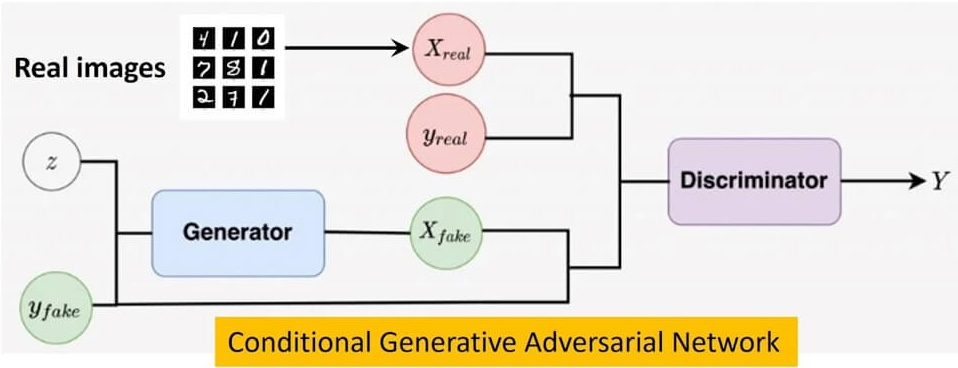
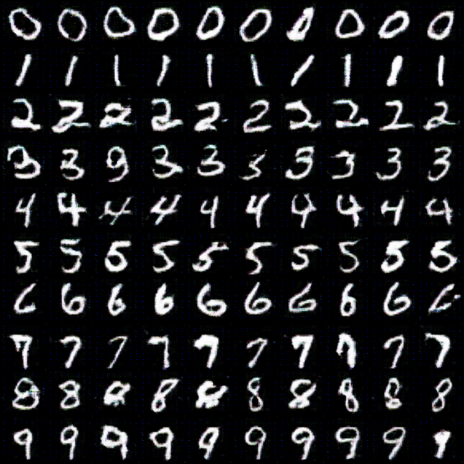
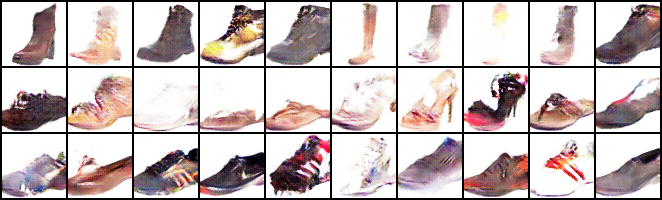
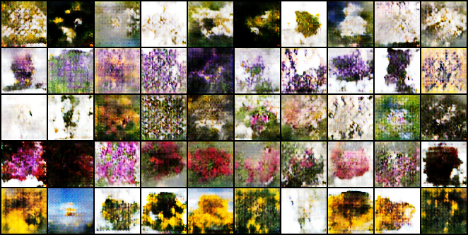
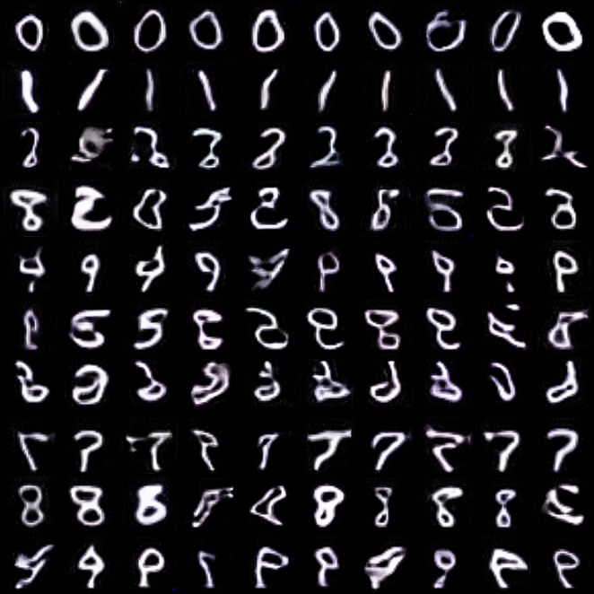
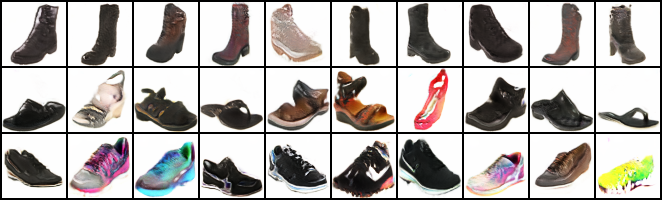
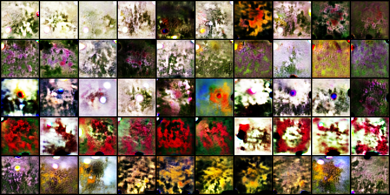

# Conditional GAN Models

## Introduction

This repository contains the comparison and evaluation of two GAN architectures for conditional image generation tasks:

1. **Conditional GAN (CGAN)**
2. **Conditional StyleGAN (cStyleGAN)**

We focus on evaluating image realism, diversity, and style fidelity using the following custom datasets:

1. **MNIST**: Handwritten digit dataset.
2. **Shoe vs Sandal vs Boots**: A dataset containing images of shoes, sandals, and boots.
3. **Flowers Dataset**: A dataset containing images of various types of flowers.

## Repository Structure

- **CGAN**: Contains all files related to the training and architecture of the Conditional GAN.
- **StyleGAN**: Contains all files related to the training and architecture of the Conditional StyleGAN.
- **Notebooks**: Contains all Jupyter notebooks used for training and experimentation.
- **Outputs**: Contains model checkpoints, output images, and transition videos of image generation over the training process.

## Getting Started

### Prerequisites

- Python 3.7+
- CUDA 10.1 or higher (for GPU support)
- pip (Python package installer)

### Clone the Repository

```bash
git clone https://github.com/yourusername/GAN-Models-Evaluation.git
cd GAN-Models-Evaluation
```

### Set Up the Environment

1. **Create a virtual environment:**

    ```bash
    python -m venv venv
    source venv/bin/activate  # On Windows use `venv\Scripts\activate`
    ```

2. **Install the required packages:**

    ```bash
    pip install -r requirements.txt
    ```

### Dataset Preparation

Make sure the datasets are organized as follows:

```
datasets/
|-- MNIST/
|   |-- train/
|   |-- test/
|
|-- Shoe_vs_Sandal_vs_Boot/
|   |-- shoe/
|   |-- sandal/
|   |-- boot/
|
|-- Flowers/
    |-- daisy/
    |-- lavender/
    |-- rose/
    |-- lily/
    |-- sunflower/
```

### Training the Models

#### Using Jupyter Notebooks

1. **Navigate to the Notebooks directory:**

    ```bash
    cd Notebooks
    ```

2. **Launch Jupyter Notebook:**

    ```bash
    jupyter notebook
    ```

3. Open the respective notebook for CGAN or StyleGAN and run the cells to start training.

#### Using Python Scripts

For running on a server or local machine without Jupyter:

1. **Navigate to the respective model directory (CGAN or StyleGAN):**

    ```bash
    cd CGAN  # or `cd StyleGAN`
    ```

2. **Run the training script:**

    ```bash
    python train.py -d path/to/data_dir -m path/to/model_save_path -a path/to/animation_save_path -e path/to/eval_images_save_path -t path/to/training_plot_path
    ```

### Command-Line Arguments

The `train.py` script accepts the following command-line arguments:

- `-d`, `--DATA_DIR`: Path to the training data directory (required).
- `-m`, `--MODEL_PATH`: Path to save the trained model (required).
- `-a`, `--ANIMATION_PATH`: Path to save the animation of the training process (required).
- `-e`, `--EVAL_PATH`: Path to save evaluation images (required).
- `-t`, `--TRAINING_PLOT_PATH`: Path to save training plots (required).

#### Example Usage:

```bash
python train.py -d datasets/MNIST/train -m outputs/cgan_model.pth -a outputs/cgan_animation.mp4 -e outputs/cgan_eval_images/ -t outputs/cgan_training_plot.png
```

### Hyperparameters

You can set hyperparameters inside the `train.py` script. Typical hyperparameters you might want to adjust include:

- Learning rate
- Batch size
- Number of epochs
- Noise dimension
- Specific architecture details

### Model Description

#### Conditional GAN (CGAN)

The CGAN model is a type of GAN where both the generator and discriminator are conditioned on some extra information, such as class labels. This enables the model to generate images that belong to a specific class.



- **Architecture:**
    - Generator: Takes a noise vector and class label as input and generates an image.
    - Discriminator: Takes an image and class label as input and outputs a probability of the image being real or fake.

#### Conditional StyleGAN (cStyleGAN)

The cStyleGAN model builds upon the StyleGAN architecture, incorporating class labels to generate images of specific categories with high style fidelity and diversity.

- **Architecture:**
    - Generator: Uses style vectors to control different aspects of the generated image and is conditioned on class labels.
    - Discriminator: Evaluates the realism of images conditioned on class labels.

## Outputs

The `Outputs` directory contains:

- Model checkpoints: Saved models during training.
- Output images: Generated images at different training stages.
- Transition videos: Videos showing the progression of image generation over the training process.

## Evaluation Metrics

We evaluate the models based on:

**Fréchet Inception Distance (FID)**: In FID, we use the Inception network to extract features from an intermediate layer. Then we model the data distribution for these features using a multivariate Gaussian distribution with mean $\mu$ and covariance $\sum$. The FID between the real images x and generated images g is computed as: $$\text{FID}(x, g) = ||\mu_{\text{real}} - \mu_{\text{gen}}||^2 + \text{Tr}(\Sigma_{\text{real}} + \Sigma_{\text{gen}} - 2(\Sigma_{\text{real}}\Sigma_{\text{gen}})^{1/2})$$

Where:
- $||\cdot||$ denotes the Euclidean distance between vectors.
- $\text{Tr}(\cdot)$ represents the trace operator, which computes the sum of the diagonal elements of a matrix.
- $(\Sigma_{\text{real}}\Sigma_{\text{gen}})^{1/2}$ denotes the matrix square root of the product of the covariance matrices.

This equation quantifies the dissimilarity between the feature distributions of the real and generated images, considering both their means and covariances. A lower FID score indicates a higher similarity between the distributions, suggesting that the generated images better match the characteristics of the real images.

## Results

| Dataset                  | Model   | FID Score |
|--------------------------|---------|-----------|
| MNIST                    | cGAN    | 2.5       |
|                          | cSGAN   | 3.8       |
| Shoe vs Sandal vs Boot   | cGAN    | 24.3      |
|                          | cSGAN   | 10.1      |
| Flower Classification    | cGAN    | 30.7      |
|                          | cSGAN   | 20.5      |

### CGAN Results

The training timelapses for all the datasets can be found at: `Outputs/CGAN/results'



CGAN - MNIST Results



CGAN - Shoe Results



CGAN - Flower Results

### Conditional StyleGAN Results

The training timelapses for all the datasets can be found at: `Outputs/StyleGAN/results'



CStyleGAN - MNIST Results



CStyleGAN - Shoe Results



CStyleGAN - Flower Results

## Acknowledgments

- This project uses datasets provided by M. Stephenson and others.
- Inspired by the work on GANs and StyleGAN by leading researchers in the field.
